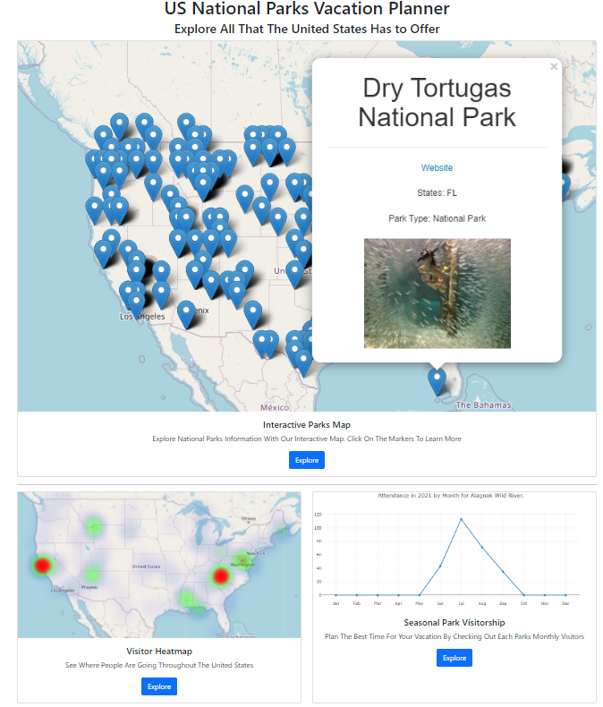

# US National Parks Vacation Planner
## NWBC-Project3-Group2

For this project, the team decided to tackle the following question:  
"Where do we go on our family vacation?"  
  

## Extract - Transformation - Load
Data was extracted from two locations provided by the National Park Service:  
* National Park Service API (https://developer.nps.gov/api/v1/)  
* National Park Service Statistics (https://irma.nps.gov/STATS/Reports/National)  

The identification of the national park sites was utilized using the "Places" API.  
Pandas was utilized to extract the API data, then then loaded into PostgreSQL to utilize in the visualizations.

The National Park Service Statistics site was used to collect recreation attendance data for 2021.  
This data was saved as a CSV file, and converted to a JSON to utilize during the anaylsis and visualization.

## Flask App
Flask App was utilized as the tool to navigate between pages.  
The initial page is index.html.  From there, flask app routes are executed when the user clicks on the appropriate link on the page.

## Visualizations
### National Park Service Location Map
The user can view a map of the United States and see all of the national park locations, shown as markers on the map.  
When the user selects a marker, a popup will show with following information:
* Park name
* Link to the NPS website for that park
* State the park is located
* Park designation
* Image of the park provided by the NPS API.  

### Park Annual Attendance
The user will be able to see which parks in the United States have the highest attendance.  
The warmer colors in the map will show locations where attendance is higher.  

### Attendance Plot by Month
The user can view park attendance for 2021 by month to determine if the park is likely to be crowded during the time period they will be traveling.  
The user can select from a drop down the park of interest, and the plot will update to reflect the selected park’s attendance by month for 2021.

